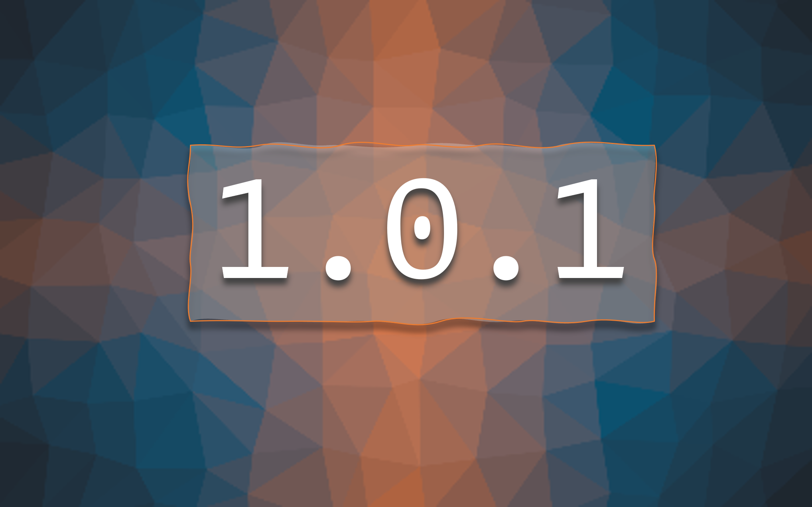

## Just for Fun, it's 1.0.1

Hello, Loyal Board Dashers! We have some exciting new features for you:

### 🍿 New Features & Enhancements

- **Facilities Request:** Submit facilities requests right from your dashboard into our turbo charged "Automagic 5000". Your process get received, parced, formatted, calcualated, recalculated, triangulated, and fed into EAM all by our robot wizards. Look Ma, no hands!

Thank you for being a part of this myBerkeley journey. Your feedback fuels our innovation, so don't hesitate to share your thoughts or report any hiccups with our dedicated support team. Together, we're shaping the future of the whole entire world!
