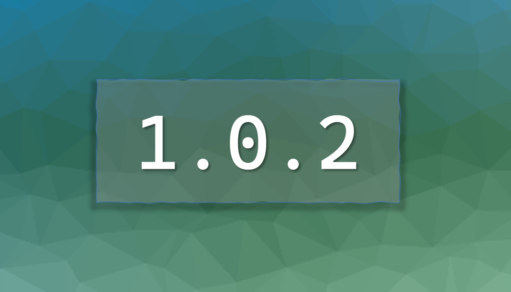

## Woo Hoo! It's 1.0.2

Hello, Loyal Board Dashers! We have some exciting new features for you:

### 🍿 New Features & Enhancements

- **Motor Pool Beta open for testing:** Manage your motor pool with ease! Book and reserve now! Missing some requirments? No problem, we have documents, tests, and forms you need to get you up and running at breakneck speed! (Speed is for getting a reservation only, not driving - just saying).
- **Access Control** app_users.iAppRoleId of 105 (fr only) redirects to facilities requests submit page 100% of the time now. Currenly for those users that is the only page they can access. This is by design.
Thank you for being a part of out myBerkeley beta test team. Your feedback helps design our improvement track. Please don't hesitate to share your thoughts or report any hiccups with our dedicated support team. Together, we're shaping the future of the whole entire universe!
